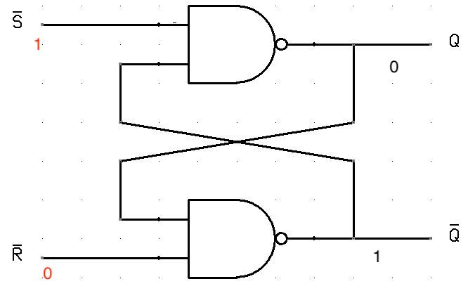

# Introduction
- Altair has 78 machine language instructions
- Part one of manual introduces the user to terminology and electronic logic
- part 2 and 3 speak about the computers actual organization and function

## A. Logic
- Boole showed how logical expressions can be analyzed with arithmetic relationships
- He published this work and much of its basis can be seen in computers
- His system of logic was called Boolean algebra
- It assumes that a logic statement can either be true or false (with no exception), this is similar to electronic circuits as they can be either on(true) or off (false). 
- A switch that is off can be seen as false but also a value of 0, a switch that is on can be seen as true and with a value of 1.
- we can create tables of this called truth tables

## B,
- We can combine the basic logic circuits to create more logic statements
- Three or more logic circuits make a logic system
- Exclusive-Or circuit can implement logical functions and add two input conditions
- Exculsive-Or circuit is called a binary adder due to the connection electronic logic has with binary (as they both only have two states)
- Two NAND circuits can be combined to create a flip flop circuit. Flip-Flop changes state only when a single arrives it can act as a short term memory.
- Multiple flip-flops can be cascaded together to form memory registers and electronic counters.
- Other logic circuits can be combines as well to form monostable and astable circuits.
- Monostable circuits have two states and are only are one of them. When they recieve a signal they change to the opposite state and then return to their normal state. 

## Flip Flop Circuits

This is a flip-flop circuit. It is able to maintain the signal it recieves (This signal can be seen as a bit). It is made of up two NAND circuits and because of those capabilities it can be cascaded together to form memory registers. 
## C.