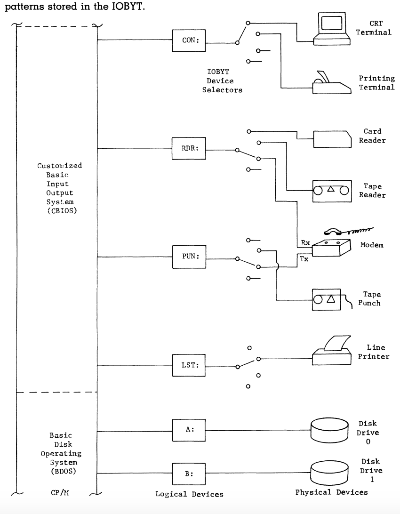

# Chapter 3 

Chapter 2 introduced us to the software components of the computer system, particularly the CP/M operating system. One of the key functions of CP/M is managing input and output (I/O) devices. This is where Chapter 3 expands (how the system assigns logical names to physical I/O devices).

## Vocab

| Acroynm | Definition |
| :-------|:------------:|
| CRT    | Console Video Display Terminal: This logical name points to a device that outputs video, such as a monitor or screen.|
| LPT    |  Line Printer: Refers to printers used to produce hard copy output from the computer. The name "LPT" is used to abstract whether the printer is a dot matrix, laser, or any other. type.       |
| CON    |  Console: Main input/output device.        |
| LST    |  List Device    |
|  RDR   |     Logical device that accesses general input devices        |
|  PUN   |   Logical device that accesses general output devices            |

## Selecting Devices in CP/M & Logical Devices & Names
- A logical device is the abstract representation of the physical hardware
- CP/M is designed to simplify communication with different devices, no matter the specific hardware configuration of the computer. 
- CP/M allows users to select devices based on these logical names. 
- We only need the logical name assigned, we don't need to interact directly with the hardware at all.
- For example, if you want to output data to a printer, you can refer to the "LPT" device, or if you need input from a punch card reader, you refer to the "RDR" device.
- Logical names make it easier to write portable programs 
- This means you can run the same code across different machines as long as they use CP/M, without needing to rewrite device-specific code.

## Disks

Disk drives are assigned logical device names as well, such as "A:" and "B:", to simplify storage device handling. These logical names serve as a shorthand for physical components in programming and system operations, allowing us and programs to refer to these devices uniformly across different machines.

This is the logical to physical mapping and selection in a CP/M computer. Notice that the modem can both read and write (RDR & PUN)
